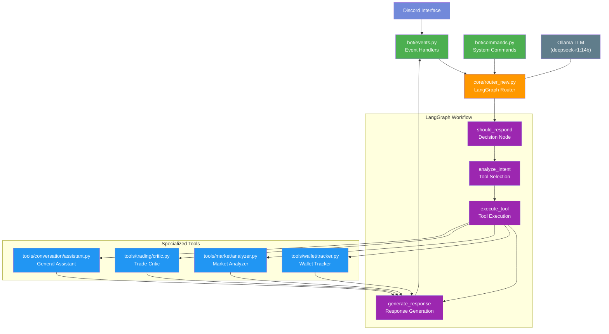

# TradeMaster LangGraph Architecture

This diagram illustrates the new architecture of the TradeMaster Discord bot using LangGraph for workflow management.

## Key Improvements with LangGraph

1. **Structured Workflow**: Clear, defined stages for message processing
2. **Conditional Logic**: Decision nodes determine when and how to respond
3. **Tool Selection**: Dynamic selection of specialized tools based on message intent
4. **State Management**: Maintains conversation context across interactions
5. **Modular Design**: Easy to add new tools and capabilities

## Message Flow

1. User sends message to Discord
2. Event handler receives message and passes to Router
3. Router initializes LangGraph workflow
4. Workflow determines if response is needed
5. If yes, analyzes intent and selects appropriate tool
6. Executes tool to get specialized response
7. Generates natural language response
8. Returns response to Discord